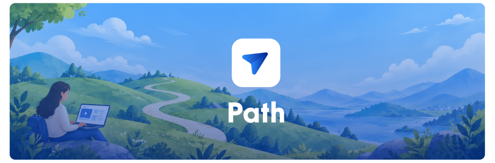

<p align="center">
  
</p>

# Path

Path records software walkthroughs and turns their captured activity into help guides or improvement specifications. Review a video alongside click screenshots and transcript segments, choose a local or cloud AI model, and edit or export the resulting Markdown.

Media is stored locally. Selecting a cloud AI provider sends the context required for that operation to the selected provider.

## What works

- Display, window, and custom-region recording with optional microphone and mouse-click capture.
- Floating recording controls, post-stop video processing, and local recording history.
- Video playback with seekable activity, click screenshots, transcript editing, and activity deletion.
- Help Guide and Spec Document presets, reusable custom instruction flows, and Markdown editing, copying, and export.
- Separate Visual and Text model selection with Ollama, OpenRouter, or configured Anthropic, OpenAI, and Google providers; local Windows whisper.cpp transcription.
- Persistent appearance/settings, encrypted provider credentials, and configurable recording-file location.

Windows is the primary development target. macOS packaging is configured, but complete native runtime and permission validation remains outstanding. Linux has no configured installer target. Current limitations are listed below; configured targets are not a claim of verified platform support.

## Getting started

Use Node.js 22.14 or newer and npm 10 or newer. Native dependencies may require the platform's C++ build tools if a compatible prebuilt binary is unavailable.

```sh
npm ci
npm run dev
```

Development starts Next.js on port 3000 and launches Electron. The browser alone cannot provide desktop capture or native storage capabilities. The launcher can reuse an existing Path renderer on that port.

AI is optional for capture and video processing. Open AI models in the application header to choose a Visual model for screenshot analysis and a Text model for document generation. Each choice is saved independently; the same model can serve both roles. For local AI, run Ollama with a vision-capable model for Visual and a text-generation model for Text. Alternatively, add a provider key in Settings, then choose a compatible cloud model. Existing profiles start with their previous model selected for both roles. AI failures may leave click descriptions or documents unavailable while recorded video remains usable.

Windows transcription uses the runtime under `apps/desktop/vendor/whisper/win32-x64/Release`. Its first run downloads an English `tiny.en` model and verifies its size and SHA-256. See the included third-party license before redistributing that runtime.

| Environment variable          | Purpose                                                                                              |
| ----------------------------- | ---------------------------------------------------------------------------------------------------- |
| `PATH_APP_RENDERER_URL`       | Development renderer URL; normal `npm run dev` sets it for Electron.                                 |
| `PATH_APP_OLLAMA_URL`         | Override the default `http://127.0.0.1:11434` endpoint. A remote host receives the supplied content. |
| `PATH_APP_LOCAL_VISION_MODEL` | Initial local analyzer model; saved model selection is applied when requests run.                    |
| `PATH_APP_USER_DATA`          | Explicit profile directory for isolated development/native checks.                                   |

Do not modify the operating system's `PATH` variable to configure the app.

## Using Path

1. Choose **New recording**, select a source, and set the microphone and click-capture options.
2. Start recording. The main window minimizes and floating controls appear. Stop is armed after two seconds to prevent accidental termination from residual input.
3. Stop to return to the workspace while video processing and optional transcription/click analysis finish.
4. Select a recording in History. Review video and activity, seek from a timestamp, edit transcript text, or remove an activity entry.
5. Select a document flow and Text model, generate a document, then edit, copy, or export its Markdown.

**Saving is explicit; unsaved text is recoverable.** While you edit, Path keeps a recovery draft that reopens after a restart or crash, marked as unsaved until you choose Save. Every generation, AI update, save, and restore is kept in the document's version history, where you can preview, compare, and restore earlier versions. Prompts, including edited defaults, are stored by the desktop app.

History supports search, sorting, renaming, and deletion. Deletion requires confirmation and permanently removes that recording's metadata and managed assets. Cancel or Escape leaves it intact. Exported Markdown files are separate and are not deleted with recordings.

## Application links

Path registers the local `pathai://` protocol when the desktop app starts. Use an installed build containing this feature, or fully quit the old desktop process and run `npm run dev` after updating the source. A browser-only preview cannot register or handle these links. Windows is the verified protocol-delivery target; see [platform limitations](specs/AppLinks.md#registration-and-compatibility).

| Route               | Behavior                                                                                                                        |
| ------------------- | ------------------------------------------------------------------------------------------------------------------------------- |
| `pathai://`         | Opens or brings Path forward. Accepts no query fields.                                                                          |
| `pathai://status`   | Requests a system notification saying "Path is running." Accepts no query fields and does not wait for pending generation jobs. |
| `pathai://generate` | Creates a new recording from an existing local video using the query fields below. It does not start screen capture.            |

Opening a protocol link can launch Path if it is closed. **`status` confirms that Path is running after activation; it cannot tell you whether Path was already running.** These are OS application links, not HTTP endpoints; they return no JSON response. Status notifications wait for initialization on a cold launch. A trailing slash is also accepted for `status` and `generate`.

The `generate` query uses case-sensitive camelCase keys:

| Key            | Required | Value and default                                                                                                                                                                                                         |
| -------------- | -------- | ------------------------------------------------------------------------------------------------------------------------------------------------------------------------------------------------------------------------- |
| `videoPath`    | Yes      | Absolute path to a readable, nonempty local video, not a `file://` URL. Path copies the source into managed storage and leaves the original unchanged.                                                                    |
| `title`        | No       | Recording title, up to 120 characters. Defaults to the source filename without its extension.                                                                                                                             |
| `type`         | No       | String up to 120 characters, reserved for future use. Currently neither stored nor used to change behavior.                                                                                                               |
| `documentType` | No       | `spec`, `help`, or a prompt name from Settings, matched case-insensitively; up to 120 characters. Defaults to the selected prompt. Edited default instructions are honored; the link does not change the selected prompt. |
| `folder`       | No       | Projects folder name, up to 80 characters, not a filesystem directory. Reuses a case-insensitive match or creates the folder. Ambiguous duplicate names are rejected. Omit to leave the recording ungrouped.              |
| `auto`         | No       | Exactly `true` or `false`; defaults to `false`. Both process the video and supplied imports. `true` then generates a document using the selected Text model or CLI tool.                                                  |
| `logPath`      | No       | Absolute path to a timestamped log file supported by the Logs importer. The configured import size limit applies.                                                                                                         |
| `elementsPath` | No       | Absolute path to a timestamped elements file supported by the Elements importer. The same size limit applies.                                                                                                             |

For optional fields other than `auto`, omission, an empty value, or the literal `null` means no supplied value. Do not pass `null` for `videoPath` or `auto`. Unknown or repeated keys are rejected; `video_path`, `document_type`, `log`, and `elemets` are not aliases. Remote URLs, network shares, device paths, credentials, ports, and fragments are unsupported. File paths are limited to 4,096 characters and the complete link to 16,384 characters.

From Windows PowerShell, a minimal import looks like this (replace the example video path):

```powershell
Start-Process 'pathai://generate?videoPath=C%3A%2FVideos%2Fdemo.mp4'
```

Use `URLSearchParams` when building links in JavaScript so spaces, `&`, `+`, and Unicode are encoded correctly. Replace the example paths with existing files and omit `logPath` or `elementsPath` when unused:

```js
const query = new URLSearchParams({
  videoPath: "C:/Videos/demo.mp4",
  title: "Demo walkthrough",
  documentType: "help", // Or "spec" or a custom prompt name.
  folder: "Tutorials",
  auto: "true",
  logPath: "C:/Videos/demo.log",
  elementsPath: "C:/Videos/demo-elements.jsonl",
});

const link = `pathai://generate?${query.toString()}`;
```

Generation requests run sequentially. Path processes the video and its speech, imports any supplied logs and elements, and then generates a document if `auto=true`. Successful generation is stored in document version history. Automatic generation stops if activity processing fails or supplied imports have no rows aligned with the video; the imported recording remains available for review after a later import or generation failure. Finish an active screen recording before importing a video.

Imported video timing uses its creation timestamp when available, otherwise its modification time minus duration as an approximation. Review and adjust the Logs/Elements offset if timestamps do not line up. A plain video cannot reconstruct mouse clicks or click screenshots without capture telemetry.

Path requests system notifications when import starts, processing begins, the requested workflow completes, or a request fails. Clicking a notification opens its recording when available. Display depends on OS support and notification settings. See [the application-link specification](specs/AppLinks.md) for validation details and [log/element formats](specs/RecordingLogsAndElements.md) for supported timestamped input.

## AI and privacy

Screen recordings, screenshots, and transcripts may contain sensitive material. Local capture and processing do not require a cloud AI provider. The Visual selection controls click screenshot analysis; the Text selection controls document generation. Each role can use a different local or cloud provider, and failures never switch providers automatically. An Ollama endpoint override may send content to another machine.

- Cloud click analysis sends a processed click screenshot with bounded nearby transcript and prior-click context.
- Cloud document generation sends the recording title, selected instructions, ordered transcript/click-description text, and sampled aligned log/element entries when present. It does not send raw video or audio.
- Provider keys are encrypted through Electron `safeStorage`. Stored keys are decrypted in main and are not returned to the renderer; saving fails if secure storage is unavailable.
- Provider discovery and model downloading require network access. First-run local transcription downloads its verified model.

Review generated documents against the recording before sharing. Model configuration and availability do not guarantee accurate descriptions or complete coverage.

## Development

```sh
npm run check
npm test
npm run build
```

`check` verifies formatting, lint, TypeScript, architecture, and unused code. `npm test` runs the default Vitest suite. `build` creates the static renderer export and desktop bundles without launching the app.

Use `npm run format` to apply Prettier or `npx prettier --write <files>` for a focused change. Native recording, capture-overlay, title-bar, and transcription checks have separate runtime requirements; see [verification](.agents/instructions/Verification.md). Native SQLite is rebuilt for Node tests and rebuilt for Electron before desktop startup or packaging. `npm run measure:persistence` measures large imports, timeline queries, and document history with the real storage code.

A development profile created by a pre-release schema is refused at startup, and nothing in it is changed. Close Path and run `npm run db:reset -- --confirm` to move that database into the profile's `backups/` folder; recording media is left in place.

For routing or static-export changes, `npm run test:renderer` builds the renderer and checks all six direct pages and the home entry, hydration, and Settings navigation in headless Chrome. It requires Chrome or a Chromium-compatible executable selected through `PATH_APP_BROWSER_EXECUTABLE`; it does not exercise native capture.

```text
apps/desktop/         Electron, recording orchestration, native adapters, AI, storage
apps/renderer/        Static Next.js Pages Router, browser workflows, and presentation
packages/database/   SQLite schema, migrations, and repositories (run in a desktop worker thread)
packages/shared/     Browser-safe contracts, IPC schemas, and messages
packages/recording-core/  Recording states, clock, and coordinate mapping
packages/timeline/   Click/transcript correlation
packages/transcription/  Transcription contract and whisper.cpp adapter
specs/               Feature specifications and acceptance criteria
.agents/              Instructions, prompts, specifications, and project memory
scripts/             Repository tooling
tests/               Interactive Electron checks
```

Start with [CONTRIBUTING.md](CONTRIBUTING.md), [AGENTS.md](AGENTS.md), and the [architecture map](.agents/instructions/Architecture.md). The renderer accesses native capabilities through a typed preload API; it does not import filesystem, SQLite, credentials, or native input implementations.

Renderer application code uses flat `src/pages`, `src/components`, `src/hooks`, `src/state`, and `src/lib` folders. Authored source, test, fixture, and script basenames use PascalCase; class files match their main exported class, and each hook has its own `useCamelCase` file. Framework/config names, public package entries, data, and generated files follow the exceptions in the [engineering contract](.agents/instructions/Engineering.md#2-readability-control-flow-and-naming). Next uses `src/pages` directly: PascalCase filenames define their routes, `_app.tsx` and `_document.tsx` provide the shared shell, and `index.tsx` exposes the workspace at `/`. Shared `RENDERER_ROUTES` values keep Electron and browser navigation aligned. The preload declaration remains at `src/Desktop.d.ts`. `src/styles/index.css` loads styles in order: Tailwind, shared defaults from `global.css`, component rules from `styles/components`, and page rules from `styles/pages`. See the [renderer conventions](apps/renderer/AGENTS.md) for ownership and routing.

## Local data

```text
<Electron userData>/
  database.sqlite               recordings, activity, imports, documents, settings, prompts
  logs/main.log                 rotated diagnostics (1 MB x 5 files, 14 days)
  credentials/ai-providers.json
  models/whisper/ggml-tiny.en.bin
  recordings/<recordingId>/
    recording.webm
    recording.mp4
    audio.wav
    transcript.json
    screenshots/click-<clickId>.png
```

SQLite stores recording metadata, editable transcript and click records, imported log and element rows, documents with their recovery drafts and version history, and settings and prompts. All SQL runs in a desktop worker thread, so large imports and history reads do not block the app. Media files remain outside the database. Microphone transcription produces `audio.wav` and a raw `transcript.json`; later transcript edits update SQLite rather than rewriting that raw file.

Settings can change the media location for future recordings. Existing files remain in their original roots, which stay registered for managed access. The database, credentials, logs, and model cache remain in the user-data directory. Only the Light/Dark appearance choice lives in the renderer profile.

## Packaging

```sh
npm run package:dir
npm run package
```

The first command builds an unpacked application; the second builds configured installers under `release/`. Windows uses NSIS; macOS uses DMG/ZIP. Windows resources include FFmpeg and whisper.cpp; macOS transcription is not wired. Signing and notarization are not configured.

Generated bundles, models, installers, credentials, local media, and environment files do not belong in source control. Preserve third-party notices and review `npm audit` before distribution. Existing generated files do not establish that a release matches or validates current source. Repository licensing and release publication require an explicit owner decision.

## Current limitations

- No completed system audio, user-facing pause/resume, thumbnails, or partial-recording recovery.
- Startup marks unfinished recordings failed and removes their incomplete managed assets.
- Playback loads the full processed MP4 into renderer memory; long-session memory use needs further validation.
- Click analysis considers at most 200 clicks. Document context includes at most 300 ordered activity entries; cloud generation requests 2,048 output tokens.
- English transcription uses `tiny.en`; multilingual/model-size selection is not exposed.
- Window capture does not yet provide reliable window-relative click hotspots. Broader multi-monitor and platform capture/permission validation remains outstanding.

See the [workflow specification](specs/RecordingWorkflow.md) for observable behavior and [project memory](.agents/memory-bank/CurrentState.md) for source-linked capability boundaries.

## License

This project is licensed under the [Apache-2.0 License](LICENSE). Third-party components and native runtimes (such as FFmpeg and whisper.cpp) retain their respective upstream licenses; see [THIRD_PARTY_NOTICES.md](THIRD_PARTY_NOTICES.md) for full attribution notices.
